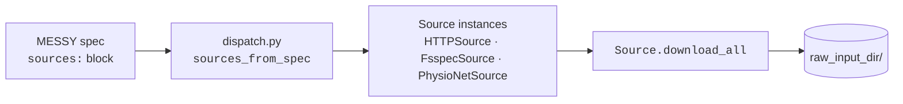
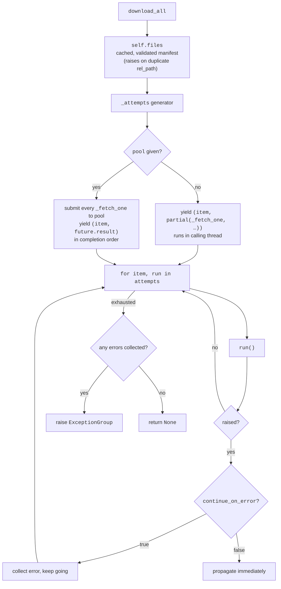
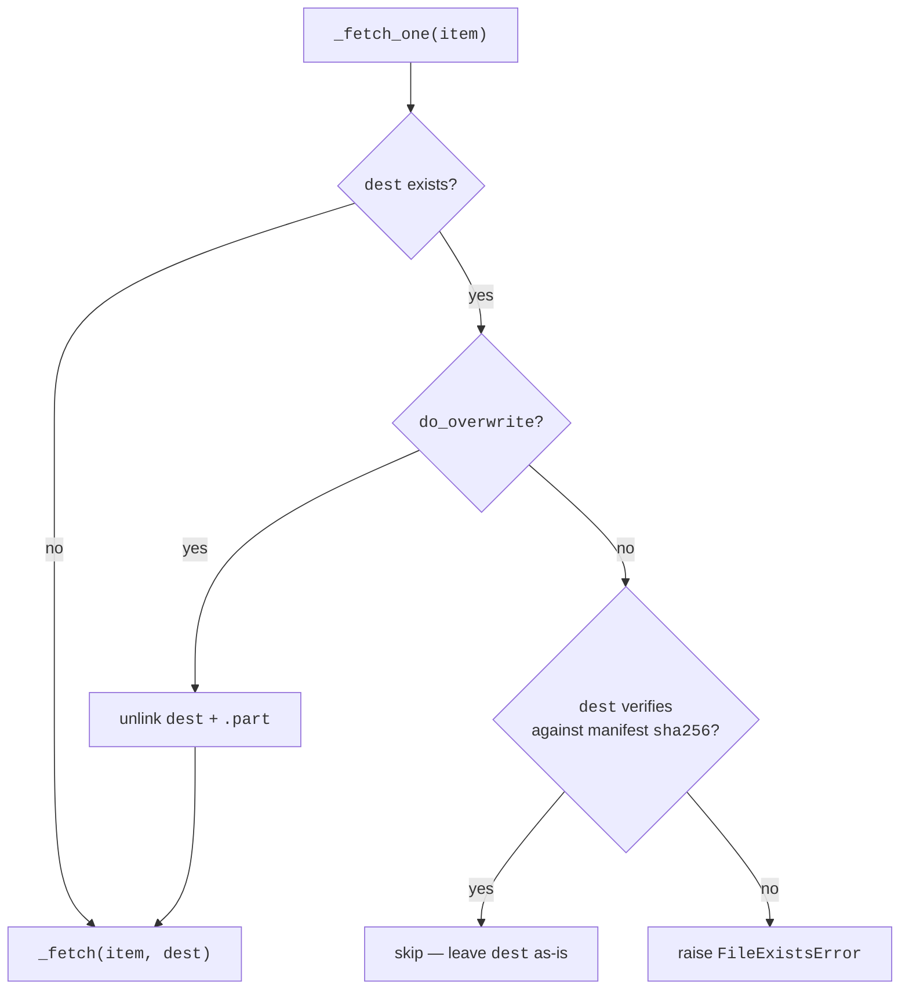

# `MEDS_extract.download`

The shared download layer for MEDS_extract-based ETLs: a small, transport-agnostic API
for staging a dataset's raw files into a local directory before the MEDS_extract stage
pipeline runs.

## Why this submodule exists

A MEDS ETL can't start until the raw source files are sitting on local disk. Getting
them there is deceptively fiddly — datasets live behind credentialed HTTP endpoints,
PhysioNet release manifests, S3/GCS buckets, or a colleague's pre-downloaded mirror;
they need checksum verification, resumable transfers, and politeness toward
rate-limited hosts.

This submodule exists so that **a downstream ETL never has to write download code at
all**. Instead, it declares *where its raw files live* in a standardized `sources:`
block in its MESSY spec, and `meds-extract-download` turns that declaration into a
deterministic, verifiable local copy. The goals:

- **One specification structure.** Every ETL describes its raw data the same way — a
    `sources:` block of typed backend entries — so the "how do I get this dataset"
    question has a uniform, reviewable answer that lives next to the rest of the spec.
- **One toolchain.** A single CLI (`meds-extract-download`) and a single Python API
    (`Source.download_all`) stage any dataset, regardless of where it's hosted. ETL
    authors compose backends; they don't reimplement transports.
- **Deterministic, verified retrieval.** SHA-256 verification, atomic writes, and a
    strict skip/overwrite policy mean a download either produces exactly the manifest's
    files or fails loudly — no silently-stale local copies leaking into a pipeline run.

This is **deliberately not a MEDS-transforms stage**. Download's I/O contract
(network/blob storage, not sharded parquet), parallelism axis (per-file transport
streams, not per-shard workers), failure model (partial-retry, resume), and config
scope all differ from the stage DAG. It sits as a *pipeline-adjacent* hook: same
ergonomic goals as a stage (Hydra-driven, CLI-addressable, override-friendly) without
being forced into the stage machinery.

## Overview

At the highest level, a MESSY spec's `sources:` block is turned into `Source` objects,
and each `Source` stages its files into one shared `raw_input_dir`:



A **`Source`** is anywhere raw data comes from. It knows two things: *what files it
offers* (`_list_files`) and *how to move one file's bytes to a local path* (`_fetch`).
Everything else — the skip/overwrite/error policy, path-traversal validation,
duplicate-destination detection, sequential-vs-parallel orchestration, error
aggregation — lives once on the `Source` ABC and is shared by every backend.

### Using it from the CLI

The common case. A MESSY spec declares its backends:

```yaml
sources:
  dataset: # the bucket selected by `key=` (default: "dataset")
    - type: physionet
      base_url: https://physionet.org/files/mimiciv/3.1
      username: ${oc.env:PHYSIONET_USER}
      password: ${oc.env:PHYSIONET_PASS}
  common: # always appended, regardless of `key=`
    - type: http
      urls:
        - https://raw.githubusercontent.com/.../concept_map.csv
```

and `meds-extract-download` stages it:

```bash
meds-extract-download \
  spec=/path/to/messy.yaml \
  raw_input_dir=/path/to/raw \
  key=dataset \           # which sources: bucket — 'common' is always appended
  concurrency=4 \         # shared thread-pool size across all sources
  continue_on_error=false \
  do_overwrite=false
```

### Using it from Python

The CLI is a thin wrapper over the library API. `download_all` is the single entry
point — sequential by default, parallel when handed a pool:

```python
from concurrent.futures import ThreadPoolExecutor
from MEDS_extract.download import HTTPSource, sources_from_spec

# Single source, sequential — the simplest possible call:
HTTPSource(urls=["https://example.com/a.csv"]).download_all("raw/")

# Multiple sources sharing one pool (what the CLI does):
sources = sources_from_spec(spec, key="dataset")
with ThreadPoolExecutor(max_workers=4) as pool:
    for src in sources:
        with src:  # close() owned network clients on exit
            src.download_all("raw/", pool=pool)
```

The rest of this document walks through the pieces behind that API.

## Files

```python
>>> from pretty_print_directory import PrintConfig
>>> print_directory("src/MEDS_extract/download", config=PrintConfig(file_extension=[".py", ".md"]))
├── README.md
├── __init__.py
├── backends
│   ├── __init__.py
│   ├── fsspec.py
│   ├── http.py
│   └── physionet.py
├── cli.py
├── dispatch.py
└── source.py

```

| File                                             | Responsibility                                                                                                                                               |
| ------------------------------------------------ | ------------------------------------------------------------------------------------------------------------------------------------------------------------ |
| [`source.py`](source.py)                         | The `Source` ABC, the `RemoteFile` manifest row, `ChecksumError`, `sha256_of`, and the whole orchestration loop (`download_all` + private helpers).          |
| [`backends/http.py`](backends/http.py)           | `HTTPSource` — explicit list of URLs. tenacity-wrapped client, `.part`-file Range-resume download, `Content-Range` validation. No crawling.                  |
| [`backends/physionet.py`](backends/physionet.py) | `PhysioNetSource(HTTPSource)` — discovers its file list from the `SHA256SUMS.txt` manifest every PhysioNet release publishes. Overrides only `_list_files`.  |
| [`backends/fsspec.py`](backends/fsspec.py)       | `FsspecSource` — any `fsspec` protocol via `universal_pathlib` (`file://`, `s3://`, `gs://`, …). For re-runs against a pre-downloaded local / cloud mirror.  |
| [`dispatch.py`](dispatch.py)                     | `source_from_config` / `sources_from_spec` — turn raw `sources:` YAML entries into concrete `Source` instances. The one place the `type:` → class map lives. |
| [`cli.py`](cli.py)                               | `meds-extract-download` — the Hydra entry point. Resolves the spec, builds the sources, owns the shared thread pool, drives every source.                    |
| [`backends/__init__.py`](backends/__init__.py)   | Re-exports the three backend classes.                                                                                                                        |
| [`__init__.py`](__init__.py)                     | Public surface: `Source`, the three backends, `source_from_config`, `sources_from_spec`.                                                                     |

## Architecture

### `Source` — the ABC

Concrete backends implement exactly two hooks:

```python
@abstractmethod
def _list_files(self) -> Iterable[RemoteFile]: ...  # what files exist
@abstractmethod
def _fetch(self, remote: RemoteFile, dest: Path) -> None: ...  # move one file's bytes
```

and the base class supplies everything users actually call:

- **`download_all(dest_dir, *, pool=None, continue_on_error=False, do_overwrite=False)`**
    — the single public fetch entry point.
- **`files`** — a `cached_property` wrapping `_list_files()`: materializes the manifest
    to a list, validates that every `rel_path` is unique, and caches the result so a
    network-backed manifest (PhysioNet's `SHA256SUMS.txt`) isn't re-fetched on a second
    `download_all` call.
- **`close()` / `__enter__` / `__exit__`** — resource lifecycle. Backends that own a
    network client (`HTTPSource`) override `close()`; the CLI registers every source
    with an `ExitStack` so clients are released deterministically.

### `RemoteFile` — the manifest row

A pure-POD `NamedTuple`, never seen by users — it only crosses the boundary between a
backend's `_list_files` and the orchestrator:

```python
class RemoteFile(NamedTuple):
    rel_path: str  # where it lands under dest_dir (forward slashes)
    sha256: str | None = None  # the only verifier the orchestrator trusts
    source_path: str | None = None  # transport's source-side address (URL / UPath spec)
```

`sha256` is the *only* skip/verify signal. Size was considered and dropped: same-size
files can differ, and a hash already catches every mismatch a size check would. A
`RemoteFile` with no `sha256` can still be downloaded, but it can never be *skipped* on
a re-run — see the overwrite policy below.

### The orchestration loop

`download_all` is one straight pass: get the validated manifest, turn it into a stream
of fetch *attempts*, and run them through a single error-collection loop.



The `_attempts` generator is the *sole* sequential-vs-parallel branch point — once it
has yielded its `(item, callable)` pairs, the outer loop is identical in both modes. In
sequential mode each `callable` runs `_fetch_one` directly when invoked; in parallel
mode every `_fetch_one` is submitted up front and the `callable` is `future.result`.

`_fetch_one` is where the per-file **skip / overwrite / error policy** lives:



The "exists but can't verify → error" rule is intentional: silently overwriting (or
silently skipping) a file we can't prove matches the manifest is how stale or
half-flushed local copies leak into a pipeline run. The user has to opt into the
ambiguity with `do_overwrite=True`.

### Pool ownership

`download_all` **never builds a thread pool**. Sequential is the default; the caller
passes a `ThreadPoolExecutor` to opt into parallelism and *owns its lifetime*. This
matters because:

- The worker cap is the caller's concern — they know whether they're hitting one
    rate-limited host or ten fast ones. A library-internal `max_workers=4` is a buried
    surprise.
- One pool can be **shared across sources**: the CLI builds a single pool sized to
    `concurrency=` and hands it to every source's `download_all`, so the bound is global
    rather than per-source.
- The CLI shuts the pool down with `shutdown(wait=False, cancel_futures=True)` rather
    than the `with` block's default `wait=True` — a `Ctrl+C` mid-download cancels queued
    work immediately instead of blocking until a multi-GiB transfer drains.

### `dispatch.py` — spec → objects

`source_from_config({"type": "http", "urls": [...]})` is the one `match` statement
mapping a `type:` string to a backend class. `sources_from_spec(spec, key="dataset")`
reads a whole `sources:` block, pulls the selected bucket plus the always-appended
`common:` bucket, and returns the constructed list. New backend = new `backends/`
module + one `case` in `dispatch.py`.

### `cli.py` — the `meds-extract-download` entry point

A Hydra entry point (`DownloadConfig` is a `hydra_registered_dataclass`). It:

1. resolves the spec path against the user's original CWD (Hydra changes CWD);
2. resolves OmegaConf interpolations on **only** the `sources:` subtree — so a combined
    MESSY file's unrelated `${oc.env:...}` interpolations in the event-conversion
    section don't need to be set just to download;
3. builds the sources via `sources_from_spec`;
4. opens an `ExitStack`, creates one shared pool, registers every source for
    `close()`, and calls `download_all` on each;
5. returns `0` on full success, `1` if any source raised.

## Adding a backend

1. Add `backends/<name>.py` with a `class FooSource(Source)` implementing `_list_files`
    and `_fetch`. Honor the `Source` invariants documented in the `source.py` docstring
    — most importantly: `_fetch` stages to a sibling `.part` file and atomic-renames,
    verifies `remote.sha256` when set, and raises (never half-writes `dest`) on failure.
2. Export it from `backends/__init__.py`.
3. Add a `case "<name>":` to `source_from_config` in `dispatch.py`.
4. Cover it with doctests in the backend module (per the project's doctest-first
    convention) and add wire-level tests to `tests/test_download.py` if it needs a real
    transport round-trip.

## Testing

- **Doctests** in each module cover the pure logic: dispatch, URL normalization,
    `SHA256SUMS.txt` parsing, and the `Source.download_all` skip/overwrite/traversal/dup
    paths (via stub sources in the `source.py` docstring).
- **`tests/test_download.py`** covers what doctests can't: `_resumable_download`'s
    wire-level behavior (Range resume, 416/206 mismatch handling) against
    `httpx.MockTransport`, end-to-end `download_all` flows, the CLI subprocess path, and
    the SIGINT-cancellation regression (which needs a real signal in a real subprocess —
    `tests/_fetcher_sigint_child.py`).
- **`tests/test_example.py`** exercises the real PhysioNet path end-to-end (gated
    behind the `integration` marker).
